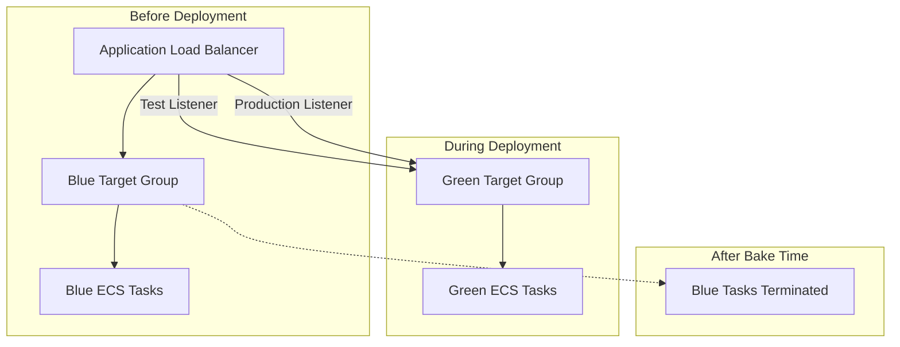

# Blue/Green Deployment
### What is a Blue/Green Deployment?

A **blue/green deployment** is a safe way to release updates to your app or service without downtime. It works by running **two identical environments**:

* **Blue**: The current live version.
* **Green**: The new version you want to release.

With this method, you test the green version first. If everything looks good, you switch traffic from blue to green. If something goes wrong, you can quickly switch back.

---

### Benefits of Blue/Green Deployment

* **Safer updates**: You test the new version before sending real user traffic.
* **No downtime**: Users won’t notice the switch — your app stays online.
* **Easy rollback**: If there’s a problem, you can go back to the old version (blue) right away.
* **Real-world testing**: Test new changes with real traffic without affecting users.
* **Consistent process**: Each deployment follows clear steps, making it more reliable.
* **Automated checks**: You can run automated tests during each step to make sure things work.

---

### Key Terms

* **Bake time**: The period when both versions (blue and green) are running after traffic is switched.
* **Blue deployment**: The current version running in production.
* **Green deployment**: The new version you’re releasing.
* **Lifecycle stage**: Steps in the deployment process, like testing before traffic is switched.
* **Lifecycle hook**: A special step (like a Lambda function) that checks if the deployment is working.
* **Listener**: Listens for incoming traffic (requests) and sends it to the right version.
* **Rule**: Tells the listener where to send traffic based on conditions.(ALB)
* **Target group**: A group of servers or containers that handle traffic.
* **Traffic shift**: The process of moving all traffic from blue to green.

---

### Things to Keep in Mind

* **More resources needed**: You’re running two versions at the same time, which uses more CPU/memory during deployment.
* **Auto scaling**: If your service auto-scales, it might still scale up/down during deployment — be careful as this could cause failures.
* **Better monitoring**: You get detailed updates on each step of the deployment.
* **Quick rollback**: Since the blue version is still running, you can go back fast if something breaks.

---


### 6 Easy Steps in the Deployment Process

1. **Preparation**
   Set up the new version (**green**) alongside the current one (**blue**). ECS gets everything ready like new service versions and target groups.

2. **Deployment**
   ECS starts running the green version in the background. The blue version still handles all user traffic.

3. **Testing**
   ECS can send test traffic to the green version to make sure it works. Regular users still connect to the blue version.

4. **Traffic Switch**
   ECS slowly or instantly shifts real user traffic from blue to green — based on your settings.

5. **Monitoring**
   ECS watches the new green version closely. If there’s a problem, it can automatically roll back to blue.

6. **Completion**
   If everything looks good, ECS can remove the old blue version. Or you can keep it a bit longer just in case.

---

### Blue/Green Deployment Workflow (Simple Overview)

1. **Start**
   All users go to the blue version. The green version is set up but not getting traffic.

2. **Create Green**
   ECS launches the green tasks and adds them to a new target group (a group of servers).

3. **Health Checks**
   ECS checks if the green version is running properly and is healthy.

4. **Test Traffic (Optional)**
   ECS can send some test requests to green (like special test headers) to confirm it works.

5. **Switch Traffic**
   ECS moves real traffic to green — all at once or slowly (your choice).

6. **Watch Closely**
   ECS checks health, logs, and alarms. If there’s a problem, it switches back to blue automatically.

7. **Bake Time**
   Both blue and green versions run for a short while to make sure everything’s fine.

8. **Finish**
   Green version becomes the new live app. Blue version can be shut down or kept as a backup.

---


## Deployment Lifecycle Stages (Defined by AWS to Monitor our Deployments)

| Stage                                   | What's Happening                                                                                        | Use this stage for lifecycle hook? |
| --------------------------------------- | ------------------------------------------------------------------------------------------------------- | ------------------- |
| **1. RECONCILE_SERVICE**               | ECS checks if you have multiple active versions. Only happens in special cases.                         | Yes               |
| **2. PRE_SCALE_UP**                   | Green version hasn't started yet. Blue is live and handling all user traffic.                           |  Yes               |
| **3. SCALE_UP**                        | Green version starts its containers (tasks), but it's not getting any traffic yet.                      |  No                |
| **4. POST_SCALE_UP**                  | Green is now running, but still no traffic. ECS checks if it's running fine.                            |  Yes               |
| **5. TEST_TRAFFIC_SHIFT**             | Green version receives **test traffic** (fake traffic just for testing). Blue still handles real users. |  Yes               |
| **6. POST_TEST_TRAFFIC_SHIFT**       | Test traffic has fully shifted to green. ECS checks if green passed the tests.                          | Yes               |
| **7. PRODUCTION_TRAFFIC_SHIFT**       | Real user traffic slowly moves from blue to green (like 10%, 50%, 100%).                                |  Yes               |
| **8. POST_PRODUCTION_TRAFFIC_SHIFT** | All real traffic is now going to green. Blue is still running for safety.                               |  Yes               |
| **9. BAKE_TIME**                       | Green version is live. ECS waits to monitor if it's working fine.                                       |  No                |
| **10. CLEAN_UP**                       | Blue version is removed. Green is now your new official version.                                        |  No                |


---

## Example Story: Simple Deployment

1. **Blue is live** (your current app).
2. You **deploy Green**.
3. ECS starts Green containers.
4. ECS sends **test traffic** to Green.
5. ✅ Green passed tests? Then go ahead.
6. ECS moves **real users** to Green **slowly**.
7. All good? Then Blue is deleted.

> * **Test Listener**: Special endpoint only for testing green.
> * **Bake Time**: Green runs for a while to ensure it's stable.
> * **Rollback**: If Green has problems, ECS switches back to Blue.

---

Here’s a **very simplified and crystal-clear version** of the **required resources and best practices** for **Amazon ECS Blue/Green Deployments**, written for beginners who want to grow to advanced levels:

---

## What You Need for ECS Blue/Green Deployment

To safely switch from your old app (blue) to your new version (green), **you must use at least one** of these:

### 1. **Load Balancer or Service Connect (Required for Traffic Shifting)**

You need one of the following so ECS can shift traffic smoothly:

* **Application Load Balancer (ALB)**
* **Network Load Balancer (NLB)**
* **Service Connect** (for ECS Services in a mesh-like setup)

> ❗ If you don’t use any of these, you can **still deploy**, but **you won’t get automatic traffic shifting** — it will be manual.

---

## 🛠️ High-Level Setup Checklist

| Step | What to Do                                                              |
| ---- | ----------------------------------------------------------------------- |
| 1  | Use **ALB**, **NLB**, or **Service Connect** in your ECS service        |
| 2  | In the service definition, set **Deployment Type = Blue/Green**         |
| 3  | Set **Deployment Controller = ECS**                                     |
| 4  | (Optional) Add extra features like:                                     |
| →    | **Bake Time** — time to monitor green before final switch               |
| →    | **CloudWatch Alarms** — auto rollback if problems                       |
| →    | **Lifecycle Hooks** — test green version during deployment using Lambda |

---

## Best Practices (Highly Recommended)

| Practice                                         | Why It's Important                                     |
| ------------------------------------------------ | ------------------------------------------------------ |
| Use **accurate health checks**                 | So ECS knows if green is healthy                       |
| Set a **bake time**                            | Wait a few minutes to catch hidden issues              |
| Use **CloudWatch alarms**                      | Auto rollback if CPU/memory/errors spike               |
| Add **lifecycle hooks**                        | Run test scripts or Lambda checks at each stage        |
| Make sure both blue and green can run together | So the switch doesn’t crash the app                    |
| Have **enough ECS capacity**                   | You need to run both versions side-by-side temporarily |
| Test your rollback process                     | Be ready in case something goes wrong                  |


---

<details>
   <summary>Application Load Balancer resources for blue/green deployments</summary>

Here is a **clean, detailed, and CLI-free documentation-style summary** of the [**official AWS ECS guide for Blue/Green deployments with Application Load Balancer**](https://docs.aws.amazon.com/AmazonECS/latest/developerguide/alb-resources-for-blue-green.html), containing all the **important concepts, configurations, and components**, excluding CLI commands as requested.

---

# Amazon ECS Blue/Green Deployment with Application Load Balancer – Clean Documentation

## Overview

To enable **Amazon ECS Blue/Green deployments with Elastic Load Balancing**, you must configure specific resources that allow ECS to route traffic between the **blue (current)** and **green (new)** versions of your service.

These configurations enable **safe deployments**, **traffic shifting**, and **automatic rollback** if issues are detected.

---

## Key Components

### 1. **Target Groups**

You need **two target groups**:

* **Primary target group** → used by the **blue (current)** service version.
* **Alternate target group** → used by the **green (new)** service version.

#### Target Group Configuration:

* **Target type**: `IP` (for Fargate or EC2 with `awsvpc` network mode)
* **Protocol**: HTTP (or any protocol used by your app)
* **Port**: The port on which your app listens (commonly 80)
* **VPC**: Must be the same VPC where ECS tasks run
* **Health check settings**: Should match your app’s readiness (e.g., `/health`, HTTP 200, thresholds)

> ECS automatically registers blue and green tasks to the correct target groups during deployment.

---

### 2. **Application Load Balancer (ALB)**

You must create an ALB that handles routing to both target groups.

#### Load Balancer Configuration:

* **Scheme**: Internet-facing or internal (based on app requirement)
* **IP address type**: IPv4
* **VPC**: Same VPC as your ECS tasks
* **Subnets**: At least two in different Availability Zones
* **Security Groups**:

  * Inbound rule: Allow traffic on listener ports (e.g., 80/443)
  * Outbound rule: Allow traffic to ECS task security group

---

### 3. **Listeners and Rules**

Listeners define how traffic is routed to target groups.

#### a. **Production Listener** (Required):

* Typically listens on port 80 (HTTP) or 443 (HTTPS)
* Initially routes traffic to the **primary target group (blue)**
* During deployment, updates to point to **alternate target group (green)**

#### b. **Test Listener** (Optional):

* Used to send test traffic to the **green version** before full rollout
* Can listen on a different port (e.g., 8080, 8443)
* Routes traffic only to the **alternate target group (green)**

#### c. **Custom Listener Rules** (Optional):

* Rules can be added to forward traffic based on:

  * **Path patterns** (e.g., `/test/*`)
  * **HTTP headers** (e.g., `X-Environment: test`)
* Useful to route only specific traffic types to the green version during testing

---

### 4. **Service Configuration in ECS**

When configuring the ECS service for Blue/Green deployments, specify:

#### Load Balancer Details:

* **Primary target group ARN**: For blue version
* **Alternate target group ARN**: For green version
* **Container name** and **container port**
* **Production listener rule ARN**: To switch traffic from blue to green
* **Test listener rule ARN** (optional): For pre-deployment testing
* **IAM role ARN**: Allows ECS to manage ALB resources on your behalf

#### Deployment Configuration:

* **Strategy**: `BLUE_GREEN` (enables blue/green mode)
* **Bake time**: Time (in minutes) to wait after switching traffic to green, to monitor performance
* **Minimum Healthy Percent**: e.g., 100 (green must be fully healthy)
* **Maximum Percent**: e.g., 200 (green + blue can run at the same time)

---

### 5. **IAM Role for Load Balancer Management**

ECS needs permission to manage ELB resources during deployment. This is done using a dedicated **IAM role**, often called the **ECS service-linked role**.

Ensure that:

* The IAM role exists with appropriate ELB management permissions
* ECS is allowed to assume this role

Refer to the [ECS IAM Role documentation](https://docs.aws.amazon.com/AmazonECS/latest/developerguide/service-linked-roles.html) for exact setup.

---

## Traffic Flow During Deployment

Here’s how traffic flows across deployment stages:

1. **Initial State**:

   * All production traffic goes to the **blue** version via the **primary target group**.

2. **Green Deployment Starts**:

   * ECS launches green tasks and registers them with the **alternate target group**.

3. **Test Traffic (Optional)**:

   * If a **test listener** is set up, ECS routes test traffic to the green version.

4. **Production Traffic Shift**:

   * ECS updates the production listener to start routing real user traffic to the green version.

5. **Bake Time Period**:

   * Both blue and green services run. ECS waits for the configured bake time to ensure the green version is stable.

6. **Deployment Complete**:

   * ECS stops the blue tasks.
   * Green becomes the **new production version**.

7. **Rollback (if needed)**:

   * If ECS detects problems (via health checks or CloudWatch alarms), it automatically shifts traffic **back to blue**.

---

## Deployment Visual Diagram



---

## Summary of Key Configuration Elements

| Component                     | Purpose                                                 |
| ----------------------------- | ------------------------------------------------------- |
| **Primary Target Group**      | Routes traffic to blue version                          |
| **Alternate Target Group**    | Routes traffic to green version                         |
| **Application Load Balancer** | Distributes traffic and manages routing                 |
| **Production Listener Rule**  | Updates during deployment to point to the green version |
| **Test Listener Rule**        | Sends test traffic to green before switching production |
| **IAM Role**                  | Gives ECS permission to manage ELB resources            |
| **Deployment Strategy**       | Set to `BLUE_GREEN`                                     |
| **Bake Time**                 | Wait period for green after traffic shift               |
| **Health Checks**             | Monitors application status                             |
| **CloudWatch Alarms**         | Optional monitoring for automated rollback              |

---

## Conclusion

Using Blue/Green deployments with ALB in ECS allows:

* Safe rollout of new application versions
* Automatic rollback in case of failure
* Controlled and testable deployments

By configuring the load balancer, target groups, listeners, and ECS service appropriately, you can achieve a highly reliable and automated deployment flow.

---

   
</details>


---

## Required Resources

### 1. Load Balancer

- **Must use Application Load Balancer (ALB)** (or NLB/Service Connect in some cases)[1][6].
- ALB must have:
  - At least one **listener** (e.g., port 80 for HTTP)
  - At least **two target groups**:
    - *Primary* (blue)
    - *Alternate* (green)[1][6].
- Health checks configured for your containers (e.g., `/health`, port 80)
- Listener **rules** for production and, optionally, test traffic (can be path- or header-based).

**Example**:  
- ALB Name: `orders-alb`
- Listener: HTTP (80)
- Production Rule: path `/` → blue target group
- Test Rule: header `x-canary: test` → green target group

### 2. IAM Permissions

- The ECS service role and any lifecycle hook Lambda roles must have permission to:
  - Manage ALB, Target Groups
  - Update ECS tasks
  - (For hooks) be invoked by ECS[2].

### 3. ECS Service

- Must be configured during creation for `Blue/Green` deployment type.
- You’ll specify:
  - Both target groups
  - Deployment/bake time
  - Test traffic routing headers (if using)
  - Lambda lifecycle hooks (if needed)

### 4. Networking

- VPC with appropriate subnets and security groups for ALB and ECS tasks[2].

## How Blue/Green Works – ECS Native Workflow

### 1. Initial State

- **Blue tasks** are running and ALB sends all production traffic to the blue target group.
- **Green tasks** do *not* yet exist.

### 2. Deploy New Revision (Green)

- You update the ECS service, choosing the new task definition revision and deployment type “Blue/Green.”
- ECS provisions green tasks, registers them with the green target group[1][6].

### 3. (Optional) Test Routing

- If you’ve configured test rules (matching a header or path), requests with those criteria are routed to green[1][6].
- All normal traffic stays on blue.

### 4. Health Checks & Validation

- ALB health checks green targets.
- ECS waits for green targets to be healthy before shifting traffic.

### 5. Traffic Shifting (Cut-over)

- When ready, ECS updates the ALB listener so **all production traffic** now goes to green (immediate cut-over for now, not progressive)[6].
- Both blue and green tasks run during "bake time" after shift.

### 6. Bake Time & Monitoring

- ECS observes both blue and green tasks.
- If health checks fail, you can roll back to blue instantly.

### 7. Complete/Rollback

- If green is healthy after bake time, ECS stops blue tasks and green is now live.
- If issues, ECS restores blue to production.

## Creating a Blue/Green Deployment – Two Scenarios

### A. For Existing Clusters/Services

You **cannot switch an existing ECS “Rolling update” service** to blue/green *in-place*.  
**You must create a new service with the blue/green deployment type.**  
1. Go to your ECS Cluster.
2. Click **Create Service**.
3. Choose:
    - Launch type (EC2/Fargate)
    - Task definition (current revision is “blue”)
    - Deployment type: **Blue/Green**
    - Attach your ALB, select two target groups (existing blue, new green)
    - Set bake time, test routing rules (header/path), and Lambda lifecycle hooks as needed
    - Configure number of desired tasks, etc.
4. Deploy.  
5. Once new service is stable, retire/cleanup the old rolling-update service.

**Tip:** You only need to create new target group(s) for the green revision; the blue group can be reused from your current service[6].

### B. From Scratch (New Service Example)

**1. Prepare Networking**
- Create VPC, subnets, security groups.

**2. Create Target Groups (via EC2 > Load Balancing > Target Groups)**
- `orders-blue-tg`
- `orders-green-tg`
- Set health check path `/health`

**3. Create Application Load Balancer**
- Attach to subnets and security groups.
- Create listener (HTTP 80).
- Create two rules:
    - Default/prod: `/` or all traffic → blue (for now)
    - (optional) Test traffic: header/path → green

**4. Register Task Definition**
- Define your container, ports, health check.

**5. Create ECS Service**
- Cluster: pick or create new
- Task definition: your app
- Deployment type: **Blue/Green**
- Assign ALB, specify both target groups
- Set bake time (e.g., 5 minutes)
- Optionally, set Lambda hooks for custom lifecycle checks
- Set scaling and desired task count

**6. Deploy!**
- ECS creates blue.
- When you update to a new task revision, ECS provisions green tasks and runs the blue/green workflow automatically.

## Example

### Imagine

- You run a Node.js API.
- You set up ALB, listeners, two target groups.
- ECS Service: deployment type = blue/green; task rev 1 = blue.

#### Scenario: Update to Revision 2 (New Node.js Release)

- Update ECS service with new task definition (rev 2).
- ECS creates green tasks, points them to green target group.
- QA uses requests like: `curl -H "x-canary: true" ...` to hit green.
- Once you confirm green is healthy (via health checks/test traffic), ECS switches all production requests to green.
- Both rev 1 & rev 2 are running briefly (bake time).
- If no errors, ECS removes blue tasks; if errors, ECS returns prod traffic to blue instantly.

## Visual Workflow Table

| Phase                 | Blue Tasks | Green Tasks | ALB Prod Traffic | ALB Test Traffic | Bake Time | Rollback Possible |
|-----------------------|------------|-------------|------------------|------------------|-----------|-------------------|
| Initial               | ✔️          |             | ✔️ (blue)        |                  |           |                   |
| Green deployment      | ✔️          | ✔️           | ✔️ (blue)        | ✔️ (test rules)  |           |                   |
| Health check & test   | ✔️          | ✔️           | ✔️ (blue)        | ✔️ (test rules)  |           |                   |
| Prod traffic shift    | ✔️          | ✔️           | ✔️ (green)       | ✔️ (test rules)  | ✔️        | ✔️                |
| Bake time monitoring  | ✔️          | ✔️           | ✔️ (green)       | ✔️ (test rules)  | ✔️        | ✔️                |
| Complete success      |            | ✔️           | ✔️ (green)       | ✔️ (test rules)  |           |                   |
| Rollback (if needed)  | ✔️          | ✔️/removed   | ✔️ (blue)        | ✔️ (test rules)  |           |                   |

## Key Considerations & Limitations

- **Resource usage:** Both blue & green run during deployment—plan capacity accordingly[1].
- **Auto Scaling:** Not blocked, but deployment may fail if there's scaling pressure[1].
- **Traffic shifting:** ECS natively supports only immediate, all-at-once shift (not canary or linear—yet)[1][6].
- **Rollback:** ECS keeps blue running during and after cutover until bake time expires for easy rollback[1][6].

---

<details>
   <summary>Frequent Q&A and Doubts</summary>

## ✅ What You're Doing
> ✅ You are using **one ECS service**, and handling **Blue/Green deployments** by creating new **task definition revisions** (v1 → v2 → v3, etc.).  
> ✅ The earlier revision (e.g., v1) is Blue, and the next revision (e.g., v2 or v3) becomes Green.

## 🟨 1. Does the Green Task Definition Get Created Automatically?
**No — you must trigger the update manually.**

- When you create a new task definition revision (say, v2), the ECS service using the Blue/Green deployment strategy does **not automatically** detect and deploy it.
- You must manually update the ECS service to **point to the new task definition revision**.
- Once updated, ECS will:
  - Launch tasks using the new revision (green)
  - Register them with the green/alternate target group
  - Start the full blue/green deployment lifecycle (test traffic, health checks, traffic shift, bake time)

> ✅ So yes — **you must manually update the ECS service to use the new revision**.

## 🟩 2. How Do Target Groups Work in Blue/Green?

Each Blue/Green ECS service has **two target groups:**

| Type            | Description                                   | ECS Behavior |
|-----------------|-----------------------------------------------|--------------|
| ✅ Primary TG   | Used by Blue (current version) tasks          | Existing     |
| ✅ Alternate TG | Used by Green (new revision) during deploy    | ECS uses it for green tasks |

So, when you created the service with deployment type `BLUE_GREEN`, you **attached two target groups** — one for Blue, one for Green.

> These target group mappings are managed **at the ECS Service level** — not in the task definition.

### ❓ Do I Need to Attach A Target Group in the Task Definition?

✅ **No.**  
You do NOT assign or associate target groups in the task definition itself.

Instead:
- The ECS **service (not task definition)** is configured with:
  - Primary target group: ECS uses it for Blue
  - Alternate target group: ECS uses it for Green

So, your **new task definition revision (Green)** will automatically be used with the **alternate target group**, as long as you:
- Update the ECS service to use that revision
- Have already defined both target groups in the service config

> ✅ Task definitions just define containers, ports, etc.  
> ❌ They don’t "know" about load balancer or target groups directly.

## 🛠️ 3. How Do I Attach the Green Target Group?

Done while creating the **ECS service** (Blue/Green Deployment type):

When you create or update the ECS service:
- In the console, you choose:
  - Load balancer: existing ALB
  - Primary target group: points to Blue version (current)
  - Alternate target group: ECS will use this automatically for Green revision during each deployment

You don’t need to attach it again when you update to a new task definition revision — ECS handles it.

> ✅ This setup is one-time per service
> 🔁 ECS handles registering Blue/Green revisions to the right target groups

## 🔁 4. How Do I Switch Traffic From Blue to Green?

It’s automatic, as part of the ECS Blue/Green deployment workflow.  
Here’s how it happens when you update the ECS service:

1. You update the **service** to use a new **task definition revision** (e.g., v3).
2. ECS launches **Green** tasks using this revision.
3. Green tasks are registered to the **Alternate (green) target group**.
4. ECS waits for health checks to pass on green tasks.
5. ECS shifts **all production traffic** from:
    - Blue target group → Green target group (ALB listener rule is updated automatically).
6. You enter the **bake time** phase — safety wait period
    - If issues are found (via alarms or failures), ECS can rollback to Blue (traffic re-switches back).
    - If no issues, ECS **terminates blue** tasks.

> ✅ So YES — ECS automatically shifts the traffic from blue to green **once health checks pass** after updating the service.

## 🧠 Recap: Your Setup & What You Need To Do

### 🔧 Your Setup:

- One ECS service → Blue/Green deployment type
- Two target groups:
  - Primary → Blue
  - Alternate → Green
- ALB listener → points initially to primary TG
- You’ve already deployed task definition v1 (Blue)
- You create task definition v2 (Green)

### 👉 What You Need to Do:

1. **Update ECS service**, choose:
   - New task definition revision = v2
   - Bake time (e.g., 5 or 10 min)
   - Optional: test traffic rules (e.g., via headers)

2. ECS will now:
   - Launch green tasks (v2)
   - Register them with the **alternate** target group
   - Auto route test traffic to green (if configured)
   - Run health checks on green
   - ✅ Auto-switch production traffic from blue → green when healthy
   - Monitor during bake time
   - Remove blue if no failures

## 🎯 Real-World Example

You have:

- ECS Service: `orders-api-service`
- Task Rev 14 = Blue
- Task Rev 15 = created as the new revision (Green)
  
You update ECS service to point to:
- Task Rev: 15
- Deploy mode: Blue/Green
- Set target groups (already configured in service)
- ECS starts deployment

✅ ECS logic:

- Registers new tasks from Rev 15 with green TG
- When healthy, switches ALB Rule → green TG
- Retains blue tasks during 5 min bake time
- Removes blue services if no issues

## ⚠️ Key Points to Remember

| Topic                          | Summary                                                                 |
|--------------------------------|-------------------------------------------------------------------------|
| Task Definition Revisions      | You must manually update the ECS service to use the new revision       |
| Target Group Assignment        | Done via ECS service configuration — not inside task definition         |
| Load Balancer Target Switching | ECS updates listener rule to point to green target group automatically |
| Traffic Cut-over               | Happens when green targets pass health checks                          |
| Requires Two Target Groups     | Primary = blue, Alternate = green                                      |
| Lifecycle                      | ECS handles provisioning, testing, shifting, and blue task removal     |

</details>

<details>
   <summary>Step-by-Step Guide to Migrate an ECS service from Rolling Update to Native Blue/Green Deployment</summary>

Here’s a **clear, step-by-step guide** to migrate an ECS service from rolling update to native Blue/Green deployment, addressing ALB and target group.

## 1️⃣ Prerequisites and Initial Checks

- **Wait for any ongoing ECS deployments to finish.**
- Confirm your service is currently using _rolling update_ deployment with an Application Load Balancer (ALB) and at least one target group.
- Ensure you have the necessary IAM permissions for ECS and load balancer actions[2].
- Verify your ALB and target groups have proper health check paths (e.g., `/health`)[3].

## 2️⃣ Should You Use the Same ALB or Multiple?

- **Use the same ALB, but different target groups for blue and green.**
  - Each service revision (blue/green) will be registered with a different target group.
  - The ALB listener will route traffic to either the blue or green target group[1][2][6][8].
  - This is the standard (and recommended) pattern for ECS Blue/Green; no need for separate ALBs unless you have a specific, advanced need.

**Example:**  
- ALB: `my-app-alb`
- Target Group 1: `my-app-blue-tg` (current)
- Target Group 2: `my-app-green-tg` (new)

## 3️⃣ Create the "Alternate" (Green) Target Group (if needed)

- Go to the EC2 console > Target Groups > Create target group.
- Select **type `ip`** (if using ECS with awsvpc mode).
- Set protocol/port to match your app (usually HTTP:80).
- Set the correct VPC.
- Configure health check path (e.g., `/health`).

## 4️⃣ Adjust Your ALB Listener Rules

- You’ll use listener rules to switch traffic between target groups.
- The **production rule** should point to your blue target group initially, and will be updated to point to green during deployment.
- If you want to use **test traffic routing** (headers, paths), you can optionally add listener rules so that *only matching requests* go to green before full cutover[2][1].
- Make sure your health check settings are appropriate for both target groups (same endpoint for both).

## 5️⃣ Migrate the ECS Service to Blue/Green Deployment

1. **Open ECS console**: https://console.aws.amazon.com/ecs/v2  
2. **Clusters** > Choose your cluster  
3. **Services** > Select your service

4. **Update Service**  
   - Expand **Deployment options**
   - For **Deployment strategy**, select `Blue/green`[2][8]
   - Set your **Bake time** (the time both blue and green run after green takes live traffic, e.g., 5 min)
   - (Optional) Set **Lambda lifecycle hooks** for automation (pre/post scale up, test, production traffic shifts, etc.)

5. **Configure Load Balancer Settings**[2]:
   - **Target Group (Primary):** Choose current (blue) target group — e.g., `my-app-blue-tg`
   - **Alternate Target Group:** Choose your green target group — e.g., `my-app-green-tg`
   - **Production Listener Rule:** Select the rule that will route all prod traffic (usually `/` path or the main rule)
   - **Test Listener Rule (optional):** Select the rule for routing special traffic (e.g., with header `x-test=true`) to green for testing before full cutover

6. **IAM Role:** Confirm ECS has the service-linked role needed to manage ALB listeners and target groups. Create the IAM role based on the ECS Blue/Green Deployment documentation and attach it in ecs service while updating it. [Click to find the IAM Policy Documentation](https://docs.aws.amazon.com/AmazonECS/latest/developerguide/AmazonECSInfrastructureRolePolicyForLoadBalancers.html)

<details>
   <summary>Click to view the Policy attached to the role which was created</summary>

## Amazon ECS infrastructure IAM role for load balancers
An Amazon ECS infrastructure IAM role for load balancers allows Amazon ECS to manage load balancer resources in your clusters on your behalf, and is used when:
- You want to use blue/green deployments with Amazon ECS. The infrastructure role allows Amazon ECS to manage load balancer resources for your deployments.
- You need Amazon ECS to create, modify, or delete load balancer resources such as target groups and listeners during deployment operations.


```json
{
    "Version": "2012-10-17",
    "Statement": [
        {
            "Sid": "ELBReadOperations",
            "Effect": "Allow",
            "Action": [
                "elasticloadbalancing:DescribeListeners",
                "elasticloadbalancing:DescribeRules",
                "elasticloadbalancing:DescribeTargetGroups",
                "elasticloadbalancing:DescribeTargetHealth"
            ],
            "Resource": "*"
        },
        {
            "Sid": "TargetGroupOperations",
            "Effect": "Allow",
            "Action": [
                "elasticloadbalancing:RegisterTargets",
                "elasticloadbalancing:DeregisterTargets"
            ],
            "Resource": "arn:aws:elasticloadbalancing:*:*:targetgroup/*/*"
        },
        {
            "Sid": "ALBModifyListeners",
            "Effect": "Allow",
            "Action": "elasticloadbalancing:ModifyListener",
            "Resource": [
                "arn:aws:elasticloadbalancing:*:*:listener/app/*/*/*"
            ]
        },
        {
            "Sid": "NLBModifyListeners",
            "Effect": "Allow",
            "Action": "elasticloadbalancing:ModifyListener",
            "Resource": [
                "arn:aws:elasticloadbalancing:*:*:listener/net/*/*/*"
            ]
        },
        {
            "Sid": "ALBModifyRules",
            "Effect": "Allow",
            "Action": "elasticloadbalancing:ModifyRule",
            "Resource": [
                "arn:aws:elasticloadbalancing:*:*:listener-rule/app/*/*/*/*"
            ]
        }
    ]
}
```
   
</details>

7. **Review & Confirm:** Double-check settings, then click **Update**.

<details>
   <summary>Click to view the screenshot of the settings</summary>

### Configuration


### After Deployment


</details>


## 6️⃣ How the New Blue/Green Flow Works

After migration, when you update your service with a new task definition:

1. ECS launches green tasks (with the new revision), attaches them to green target group.
2. **Optionally**: Test requests matching your test listener rule (header/path) will hit green; all other traffic still hits blue[1].
3. When green passes health checks, ECS rewires the ALB listener to send all production traffic to the green target group instantly (atomic switch—no downtime)[1][2][6].
4. After **bake time**, if no alarms trigger and green stays healthy, ECS removes blue tasks.
5. If there’s a problem during bake time, ECS can instantaneously switch traffic back to blue (rollback)[1][6].

## 7️⃣ Health Checks & Listener Rules — What Should You Change?

- **Target Groups:** Both blue and green target groups should:
  - Use the same health check configuration (endpoint, thresholds).
  - The health check should be suitable for "readiness" (not just "alive").
- **Listener Rules:**
  - Main production rule points to blue, will update to green on deployment.
  - Optional: Add a header-based or path-based rule if you want to test green with limited traffic first before a production cutover.

**You do NOT need to create a new ALB** unless you want total traffic separation across services/products. Just add the alternate target group and update listener rules as needed.

## 🎯 Example Workflow

1. **Current State:**  
   - ECS Service: Rolling update, deploys to `my-app-blue-tg`
   - ALB: Production listener points to `my-app-blue-tg`

2. **Prep for Migration:**  
   - Create `my-app-green-tg`
   - Confirm correct health checks

3. **Migrate Service to Blue/Green:**  
   - Update ECS service for Blue/Green, select both TGs

4. **On Next Update:**  
   - Deploy new task definition (revision)
   - ECS launches green tasks in `my-app-green-tg`
   - (Optional) Test with header/path if configured
   - ECS switches production rule to `my-app-green-tg` after green passes health checks

5. **Bake Time:**  
   - Traffic is on green; blue tasks still running in case rollback needed

6. **Completion:**  
   - ECS stops blue tasks after bake time if all is healthy

## 🔑 Key Tips

- **One ALB, two target groups** per service is standard for blue/green[1][2][6].
- **Always set health check paths** consistently across both target groups.
- **Update listener rules** only if you want custom test traffic, otherwise just ensure the main production rule exists.
- **Bake time is important** for rollback safety—set to a few minutes at least.

[1] https://docs.aws.amazon.com/AmazonECS/latest/developerguide/blue-green-deployment-how-it-works.html
[2] https://docs.aws.amazon.com/AmazonECS/latest/developerguide/update-rolling-to-bluegreen.html
[3] https://docs.aws.amazon.com/AmazonECS/latest/developerguide/create-blue-green.html
[4] https://aws.amazon.com/blogs/compute/bluegreen-deployments-with-amazon-ecs/
[5] https://docs.aws.amazon.com/AmazonECS/latest/developerguide/update-bluegreen-to-rolling.html
[6] https://dev.to/t-kikuc/ecs-native-bluegreen-is-here-with-strong-hooks-and-dark-canary-8ff
[7] https://cloudonaut.io/ecs-deployment-options/
[8] https://aws.amazon.com/blogs/aws/accelerate-safe-software-releases-with-new-built-in-blue-green-deployments-in-amazon-ecs/
[9] https://repost.aws/knowledge-center/codedeploy-ecs-blue-green-deployment
[10] https://aws.amazon.com/tw/blogs/compute/bluegreen-deployments-with-amazon-ecs/
   
</details>
